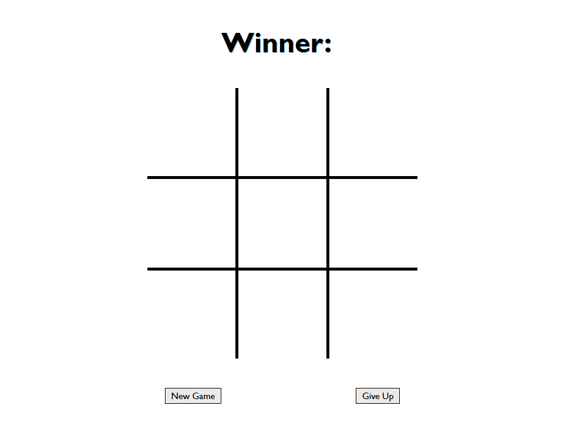

# Tic Tac Toe

## Live Site
[Live Site](https://tic-tac-toe-afink.netlify.app/)

## Goals
- Practice DOM manipulation and event handling with vanilla JS
- Save / restore game state from session storage
- Practice Object Oriented Programming via classes that manage board and player logic
- Implement logic for computer player to make smart move choices

## Features
- 1st player (X) is randomly assigned
- Computer takes its turn in response to player turn, or right away if assigned as 1st player
- Computer selects moves based on the first matching case
    - winning move for itself
    - the player has a winning move that can be blocked
    - a random available space
- Once a winner is determined the winning player's symbol will be shown (or 'None' in the case of a tie)
- Player can choose to 'give up' during an active game, in which case the computer is declared the winner
- Player can choose to start a new game after a winner has been determined
- State of the game board, player's symbol, and winner (if determined) are stored to session storage and restored upon page refresh

## Technologies Used
- HTML
- CSS
- JavaScript

## Ideal Future Improvements
- Add aditional styling and ensure responsiveness across screen sizes
- Add a wins counter and track wins/losses across multiple games
- Add labels to HTML for accessibility & perform screen reader testing
